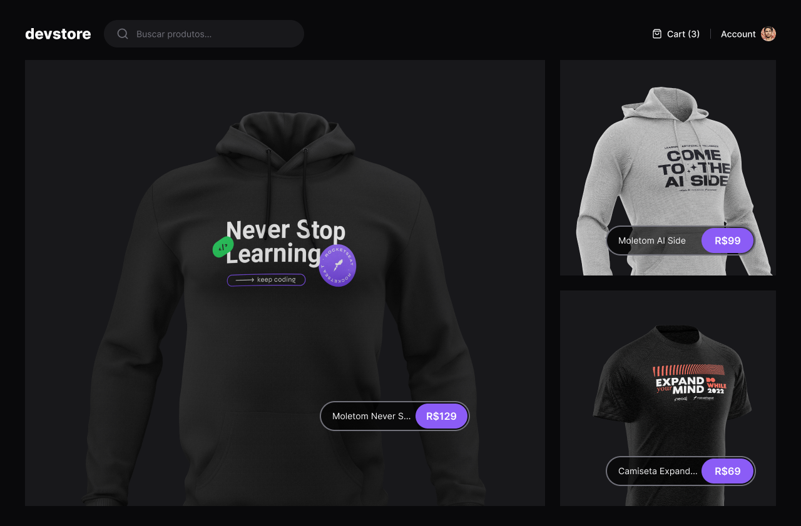
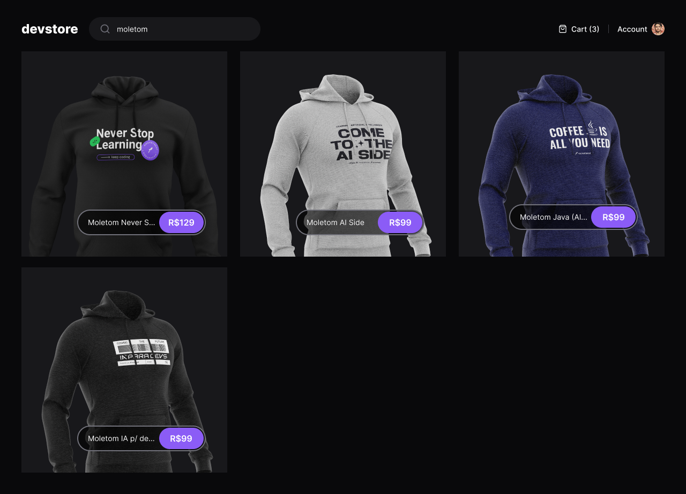
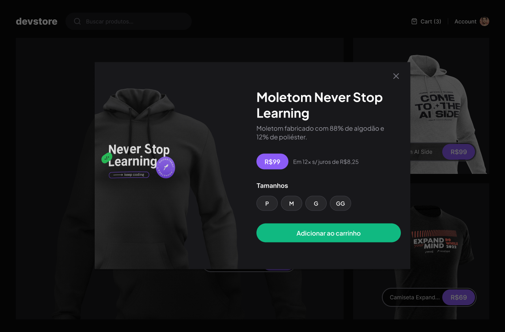
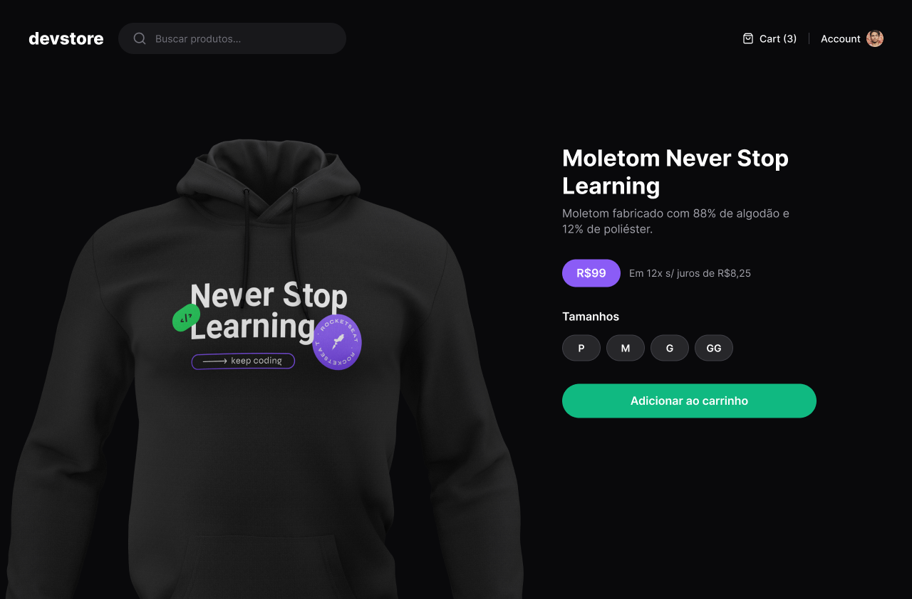

# ⚡ E-Commerce Frontend – Next.js (App Router)

A modern, responsive e-commerce frontend built using **Next.js 15 (App Router)** and **TypeScript**, showcasing advanced features of React and modern frontend architecture. The project includes dynamic routing, server-side streaming, metadata handling, and a comprehensive Cypress testing setup.

## 🖼️ Preview

### 🏠 Home Page



### 🔍 Search



### ➕ Add to Cart Modal



### 🛍️ Product Page



---

## 🚀 Features

- ✅ **React Server Components** (RSC)
- ⏳ **Suspense and Loading UI**
- 🧠 **Streaming and SSR** (Server-Side Rendering)
- 📦 **Route Handlers (API routes with Next.js)**
- 🧾 **Metadata and Open Graph Tags** for SEO
- 💾 **Cache and Memoization**
- 🏗️ **Static Generation (SSG)**
- ⚙️ **Environment Variables** support
- 🧪 **End-to-End Testing with Cypress**
- 🌀 **Tailwind CSS Integration**
- ✅ **Fully responsive design**
- 📘 **Built entirely in TypeScript**

---

## 🧰 Tech Stack

- **Next.js 15 (App Router)**
- **React 18**
- **TypeScript**
- **Tailwind CSS**
- **Cypress**
- **PNPM**
- **ESLint + Prettier**

---

## 📂 Project Structure

```text
cypress/               # Cypress E2E test configuration and specs
src/
├── app/               # App Router structure (pages, layouts, templates, loading)
├── components/        # Shared UI components
├── contexts/          # React context providers
├── data/
│   └── types/         # TypeScript interfaces and data definitions
```

## 👨‍💻 Developer Notes

This project demonstrates advanced usage of the **Next.js App Router**, embracing the latest React and server-side rendering features. It emphasizes performance, scalability, and maintainability through:

- Clean separation of concerns with components, contexts, and typed data  
- Strong typing across the entire codebase with **TypeScript**  
- Streaming and caching strategies with server-side rendering  
- SEO optimization through structured metadata  
- A complete E2E testing setup using **Cypress**  
- Full **Tailwind CSS** integration for rapid UI development
